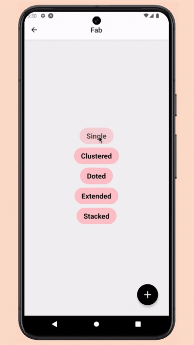

# Demo
Demo of the FAB component on Android and iOS devices.

  
  
  
  
  

## Overview

Experience our Floating Action Button (FAB) component in action across both Android and iOS platforms. The demonstrations below showcase the smooth animations, customizable themes, and responsive behavior of the component.

  

    <h3>Android Demo</h3>
    
  

  

    <h3>iOS Demo</h3>
    
  

## Features

- 🚀 Multiple FAB variants (Single, Extended, Stacked, Clustered, Doted)
- 🎨 Customizable themes (Light/Dark)
- 🔄 Smooth animations and transitions
- 📱 Works on iOS and Android
- 📚 TypeScript support
- 🎯 Support for custom icons and components

:::tip Customization Options
- Flexible component styling
- Dynamic behavior control
- Adjustable animation timing
:::

## Try It Yourself
To get started with this component in your own project, check out our [installation guide](/docs/rn-fab/installation) and [basic usage examples](/docs/rn-fab/basic-usage).

:::tip Video Tutorial

  <a href="/docs/rn-fab/tutorial#video-tutorial" style={{ textDecoration: 'none' }}>
    

      
      <h3 style={{ margin: '0', color: 'rgb(38, 121, 67)' }}>Watch Implementation Guide</h3>
      
Follow our step-by-step guide to integrate and customize the FAB component in your React Native application

    

  </a>

:::