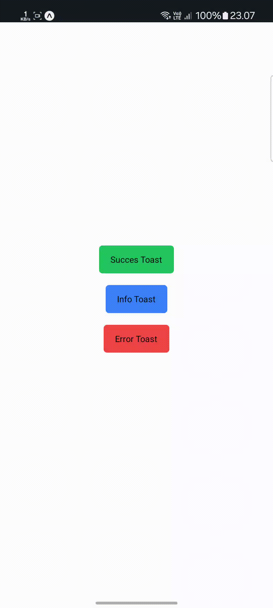

# Demo
Demo of the Toast component on Android and iOS devices.

## Overview

Experience our Toast component in action across both Android and iOS platforms. The demonstrations below showcase the smooth animations, customizable styles, and responsive behavior of the component.

  

    <h3>Android Demo</h3>
    

      
    

  

  

    <h3>iOS Demo</h3>
    

      
    

  

## Features

- 🎨 Customizable styles and animations
- 📱 iOS and Android native feel
- 💫 Smooth animations using react-native-reanimated
- 🔄 Queue management for multiple toasts
- ⏱️ Configurable duration and auto-dismiss
- 🎯 Custom content support
- 🛡️ Safe area support

:::tip Performance Optimization
For optimal performance, consider these best practices:
- Memoize custom toast content components
- Keep toast messages concise
- Use appropriate animation durations
- Implement proper cleanup for toast subscriptions
:::

:::danger Common Pitfalls
Be cautious of these common issues:
- Avoid showing too many toasts simultaneously
- Don't trigger toasts during animations
- Ensure proper z-index handling
- Test thoroughly on both platforms
:::

## Key Interactions Demonstrated

### Toast Types
- Success notifications with checkmark icon
- Error messages with warning symbol
- Info toasts with custom icons
- Loading states with spinners

### Animation Features
- Smooth fade in/out transitions
- Slide animations from top/bottom

### Customization Options
- Custom styling and themes
- Dynamic content rendering
- Flexible positioning
- Duration control

:::tip Toast Best Practices
To provide the best user experience:
- Keep messages short and clear
- Use appropriate toast duration
- Position toasts consistently
- Add proper spacing between multiple toasts
:::

:::danger Memory Management
Watch out for these issues:
- Clear toast queues on component unmount
- Handle memory leaks from animations
- Manage toast lifecycle properly
- Clean up custom content references
:::

## Try It Yourself
To get started with this component in your own project, check out our [installation guide](/docs/rn-toast/installation) and [basic usage examples](/docs/rn-toast/basic-usage).

:::tip Video Tutorial

  <a href="/docs/rn-bottom-sheet/tutorial#video-tutorial" style={{ textDecoration: 'none' }}>
    

      
      <h3 style={{ margin: '0', color: 'rgb(38, 121, 67)' }}>Watch Implementation Guide</h3>
      
Follow our step-by-step guide to integrate and customize the toast component in your React Native application

    

  </a>

:::