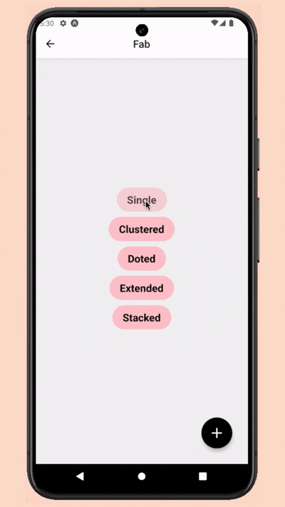

# @masumdev/rn-fab

A highly customizable Floating Action Button (FAB) component for React Native. Supports multiple variants including single, extended, stacked, clustered, and doted layouts. Built with smooth animations and optimized for both iOS and Android platforms.

[](https://github.com/sponsors/masumrpg)

<div style="display: flex; gap: 8px;">
  
  
  
  
  
</div>

## Demo

<p align="center">
  
  
</p>

## Youtube Tutorial
Soon
<!-- <p align="center">
  <a href="https://www.youtube.com/watch?v=udjs1sdXJTU" target="_blank">
    
  </a>
</p> -->

## Features

- 🚀 Multiple FAB variants (Single, Extended, Stacked, Clustered, Doted)
- 🎨 Customizable themes (Light/Dark)
- 🔄 Smooth animations and transitions
- 📱 Works on iOS and Android
- 📚 TypeScript support
- 🎯 Support for custom icons and components
- 🔍 Flexible positioning and styling

## Installation

### Prerequisites

1. Make sure you have React Native project set up with the following peer dependencies:

    ```json
    {
      "react": "^18.2.0",
      "react-native": "^0.76.9",
      "react-native-reanimated": "^3.16.7",
    }
    ```

    ```bash
    npm install react-native-reanimated
    # or
    yarn add react-native-reanimated
    # or
    pnpm add react-native-reanimated
    # or
    bun add react-native-reanimated
    ```

2. Reanimated plugin setup:

   If you are using Expo, you need to configure the Reanimated plugin in your `babel.config.js` file. Add the following configuration:

   ```javascript
   module.exports = function(api) {
     api.cache(true);
     return {
       presets: ['babel-preset-expo'],
       plugins: ['react-native-reanimated/plugin'], // Add this line
     };
   };
   ```


3. Install the library:

    ```bash
    npm install @masumdev/rn-fab
    # or
    yarn add @masumdev/rn-fab
    # or
    pnpm install @masumdev/rn-fab
    # or
    bun add @masumdev/rn-fab
    ```

## Usage

### Basic Setup

```tsx
import { Fab } from '@masumdev/rn-fab';
import { View } from 'react-native';
import { PlusIcon, EditIcon, TrashIcon } from 'lucide-react-native'; // or any icon library

// Single FAB
export const SingleFAB = () => (
  <Fab
    variant="single"
    icon={<PlusIcon color="white" />}
    onPress={() => console.log('FAB pressed')}
    theme="light"
    style={{ backgroundColor: '#007AFF' }}
  />
);

// Extended FAB with label
export const ExtendedFAB = () => (
  <Fab
    variant="extended"
    items={[
      {
        icon: <EditIcon color="white" />,
        label: "Edit",
        onPress: () => console.log('Edit pressed')
      }
    ]}
    theme="light"
  />
);

// Stacked FAB
export const StackedFAB = () => (
  <Fab
    variant="stacked"
    items={[
      {
        icon: <EditIcon color="white" />,
        onPress: () => console.log('Edit')
      },
      {
        icon: <TrashIcon color="white" />,
        onPress: () => console.log('Delete')
      }
    ]}
    theme="light"
  />
);
```

### Configuration Options

Each FAB variant supports these common props:

```tsx
type CommonProps = {
  theme?: 'light' | 'dark';           // Theme variant
  style?: ViewStyle;                   // Custom styles
  containerStyle?: ViewStyle;          // Container styles
  plusIcon?: React.ReactNode;          // Custom plus icon
  isOpen?: (prev: boolean) => void;    // Open state callback
};

// Variant-specific props are also available
type FabItem = {
  icon: React.ReactNode;          // Icon component
  onPress: () => void;                 // Press handler
  label?: string;                      // Label (for extended/clustered)
};
```

### Advanced Usage

```tsx
// Clustered FAB with labels
const ClusteredFAB = () => (
  <Fab
    variant="clustered"
    items={[
      {
        icon: <CameraIcon color="white" />,
        label: "Camera",
        onPress: () => console.log('Camera')
      },
      {
        icon: <GalleryIcon color="white" />,
        label: "Gallery",
        onPress: () => console.log('Gallery')
      }
    ]}
    theme="light"
    isOpen={(open) => console.log('FAB is open:', open)}
  />
);

// Doted FAB with custom plus icon
const DotedFAB = () => (
  <Fab
    variant="doted"
    items={[
      {
        icon: <HomeIcon color="white" />,
        onPress: () => console.log('Home')
      },
      {
        icon: <SettingsIcon color="white" />,
        onPress: () => console.log('Settings')
      }
    ]}
    theme="light"
    plusIcon={<CustomPlusIcon />}
  />
);
```

## API Reference

### Common Props

Props available for all FAB variants:

| Prop | Type | Default | Description |
|------|------|---------|-------------|
| theme | 'light' \| 'dark' | 'light' | FAB display theme |
| style | ViewStyle | - | Custom styles for FAB |
| containerStyle | ViewStyle | - | Custom styles for FAB container |
| plusIcon | ReactNode | - | Custom icon for plus button |
| isOpen | (prev: boolean) => void | - | Callback when FAB is opened/closed |

### FAB Variants

#### Single FAB
Basic FAB with a single action.

| Prop | Type | Required | Description |
|------|------|----------|-------------|
| variant | 'single' | Yes | FAB variant type |
| icon | ReactNode | No | Icon component |
| onPress | () => void | No | Callback when FAB is pressed |

#### Extended FAB
FAB with text label next to the icon.

| Prop | Type | Required | Description |
|------|------|----------|-------------|
| variant | 'extended' | Yes | FAB variant type |
| items | Array<ExtendedItem> | Yes | Array of 1-3 FAB items |

Tipe `ExtendedItem`:
```ts
{
  icon: ReactNode;     // Icon component
  onPress: () => void;      // Callback when item is pressed
  label: string;            // Text label
}
```

#### Stacked FAB
Vertically stacked FAB.

| Prop | Type | Required | Description |
|------|------|----------|-------------|
| variant | 'stacked' | Yes | FAB variant type |
| items | Array<StackedItem> | Yes | Array of 1-3 FAB items |

Tipe `StackedItem`:
```ts
{
  icon: ReactNode;     // Icon component
  onPress: () => void;      // Callback when item is pressed
}
```

#### Clustered FAB
FAB with labels arranged in an arc.

| Prop | Type | Required | Description |
|------|------|----------|-------------|
| variant | 'clustered' | Yes | FAB variant type |
| items | Array<ClusteredItem> | Yes | Array of 1-3 FAB items |

Tipe `ClusteredItem`:
```ts
{
  icon: ReactNode;     // Icon component
  onPress: () => void;      // Callback when item is pressed
  label: string;            // Text label
}
```

#### Doted FAB
FAB with dot indicators.

| Prop | Type | Required | Description |
|------|------|----------|-------------|
| variant | 'doted' | Yes | FAB variant type |
| items | Array<DotedItem> | Yes | Array of 1-3 FAB items |

Tipe `DotedItem`:
```ts
{
  icon: ReactNode;     // Icon component
  onPress: () => void;      // Callback when item is pressed
}
```

### Theme Options

| Theme | Description |
|-------|-------------|
| light | Light background with dark icons |
| dark | Dark background with light icons |

## License

MIT